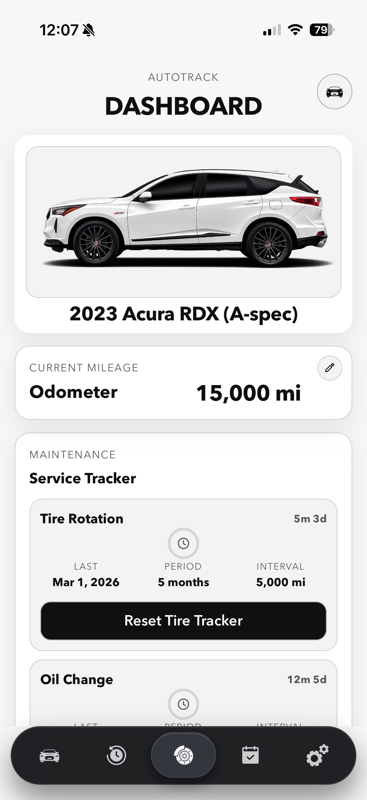
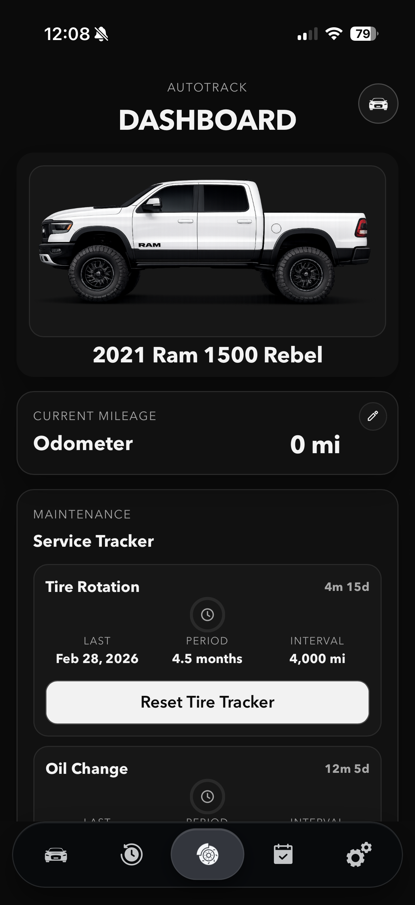
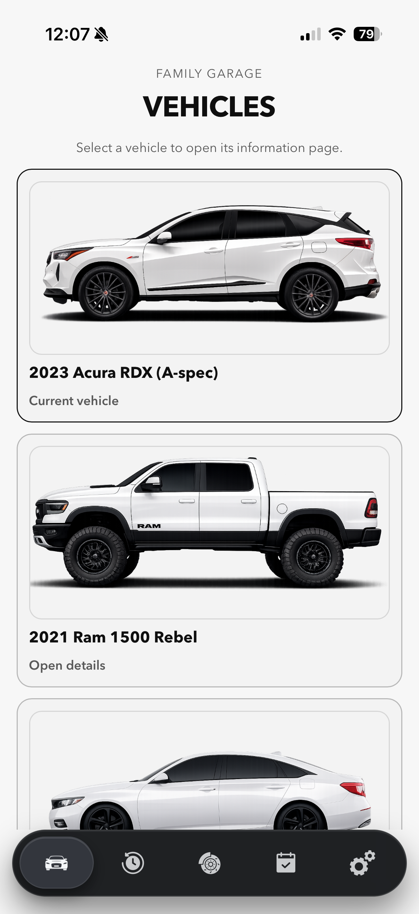
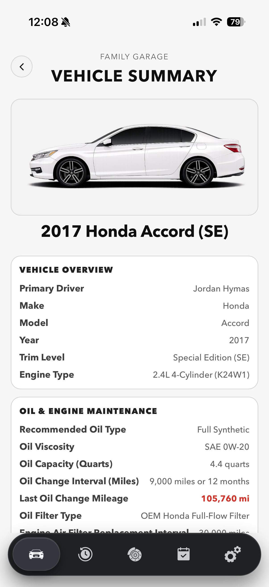

# AutoTrack

<p align="center">
  <video controls muted playsinline width="360">
    <source src="GithubPhotos/fullPWA.mp4?raw=1" type="video/mp4">
  </video>
</p>
<p align="center">
  <a href="GithubPhotos/fullPWA.mp4?raw=1">If the video player does not render here, tap to open fullPWA.mp4.</a>
</p>

AutoTrack is a mobile-first web application built in a PWA style for tracking family vehicles.

The core goal of the app is simple:
- track when each vehicle is due for tire rotation
- track when each vehicle is due for an oil change
- keep key vehicle details and service history in one place

This is currently used as an internal tool for my family's vehicles and is actively being prepared for broader production use.

## Screenshots

<table align="center">
  <tr>
    <td align="center"><strong>Dashboard</strong></td>
    <td align="center"><strong>Dark Mode</strong></td>
  </tr>
  <tr>
    <td align="center"></td>
    <td align="center"></td>
  </tr>
  <tr>
    <td align="center"><strong>Vehicles</strong></td>
    <td align="center"><strong>Vehicle Info</strong></td>
  </tr>
  <tr>
    <td align="center"></td>
    <td align="center"></td>
  </tr>
</table>

## Main Features

- Multi-vehicle dashboard with per-vehicle maintenance countdowns
- Odometer tracking and service history logs
- Vehicle information pages for each family vehicle
- Calendar/reminders view for service planning
- Light and dark themes
- Mobile tab-based navigation designed for iPhone usage
- SQLite-backed storage API
- Web Push notifications delivered from server-side sweeps

## Tech Stack

- Next.js 15
- React 19
- Radix UI Tabs
- SQLite (`better-sqlite3`)
- Service Worker + Web Push

## Local Development

1. Install dependencies:

```bash
npm install
```

2. Start local dev server:

```bash
npm run dev
```

3. Open:

```text
http://localhost:3000
```

## Production Build

```bash
npm run build
npm run start
```

## How Notifications Work (VPS -> Device)

AutoTrack sends maintenance notifications using standard Web Push.

High level flow:
1. User installs the app to Home Screen (PWA mode) and enables notifications.
2. The app creates a push subscription and stores it on the server.
3. Your VPS runs a scheduled sweep (for example every minute) against `/api/push/sweep`.
4. Sweep logic checks due/overdue maintenance states and sends push notifications to subscribed devices.
5. Notifications are delivered by the OS even when the app is closed and the phone is locked.

## Required Environment Variables

```bash
NEXT_PUBLIC_VAPID_PUBLIC_KEY=...
VAPID_PUBLIC_KEY=...
VAPID_PRIVATE_KEY=...
VAPID_SUBJECT=mailto:you@yourdomain.com
AUTOTRACK_CRON_SECRET=choose-a-long-random-secret
```

Generate keys once with:

```bash
npx web-push generate-vapid-keys
```

## Manual Sweep Test

```bash
curl -X POST "https://autotrack.jordanhymas.com/api/push/sweep" \
  -H "x-autotrack-cron-secret: <AUTOTRACK_CRON_SECRET>"
```

If scheduled sweeps stop running, push alerts will not fire on time.
